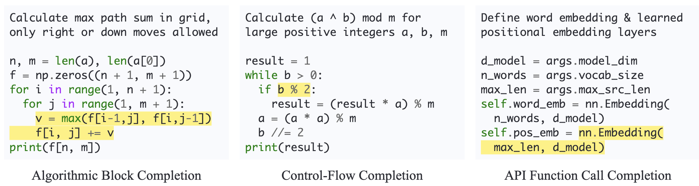

# SAFIM Benchmark


Syntax-Aware Fill-in-the-Middle (SAFIM) is a benchmark for evaluating Large Language Models (LLMs) on
the code Fill-in-the-Middle (FIM) task. SAFIM has three subtasks: Algorithmic Block Completion,
Control-Flow Expression Completion, and API Function Call Completion. SAFIM is sourced from code
submitted from April 2022 to January 2023 to minimize the impact of data contamination on evaluation
results.



- Authors: [Linyuan Gong](https://gonglinyuan.com), Sida Wang, Mostafa Elhoushi, Alvin Cheung
- Paper: [https://arxiv.org/abs/2403.04814](https://arxiv.org/abs/2403.04814)
- Leaderboard: [https://safimbenchmark.com](https://safimbenchmark.com)
- Huggingface
  Dataset: [https://huggingface.co/datasets/gonglinyuan/safim](https://huggingface.co/datasets/gonglinyuan/safim)

## Environment Setup

Python version: 3.8.12

CUDA version: 11.7

Docker CE version: 24.0.7

Install dependencies:

```bash
python -m pip install \
torch==1.13.0+cu117 torchvision==0.14.0+cu117 torchaudio==0.13.0 \
--extra-index-url https://download.pytorch.org/whl/cu117
python -m pip install \
Jinja2==3.1.2 openai==0.28.1 tiktoken==0.5.2 transformers==4.36.0 \
tqdm==4.64.1 tree-sitter==0.20.4 requests==2.28.1 datasets==2.18.0
```

If you encounter issues with `libstd++`, and you are using a conda environment, you can try this solution:

```bash
conda install -n [ENV_NAME] libstdcxx-ng=12.2.0 -c conda-forge
```
Build Tree-Sitter parsers:

```bash
bash setup_tree_sitter.bash
```

In another terminal, build and run ExecEval daemon:

```bash
git clone https://github.com/ntunlp/ExecEval
cd ExecEval
docker build . -t exec-eval:1.0
docker run -it -p 5000:5000 -e NUM_WORKERS=2 exec-eval:1.0
```

## Reproduce Results in Our Paper

### GPT-3.5 + One-Shot Prompt + Algorithmic Block Completion

Generate:

```bash
export OPENAI_API_KEY=YOUR_OPENAI_API_KEY_HERE
mkdir -p cache outputs_block
python generate.py \
  gpt-3.5-turbo-0301 \
  block \
  cache/gpt-3.5-turbo-0301.json \
  outputs_block/gpt-3.5-turbo-0301-few-ex-tb.jsonl \
  fewshot \
  --post_processors extract_code truncate_fewshot truncate_line_until_block  # syntax-aware truncation
```

Evaluation:

```bash
mkdir -p results_block
python evaluate.py \
  block \
  outputs_block/gpt-3.5-turbo-0301-few-ex-tb.jsonl \
  results_block/gpt-3.5-turbo-0301-few-ex-tb.jsonl
```

Show results:

```bash
python show_detailed_results.py \
  block \
  results_block/gpt-3.5-turbo-0301-few-ex-tb.jsonl
```

The expected outcome is:

```
gpt-3.5-turbo-0301-few-ex-tb,28.381643,39.975797,27.701863,22.495274,31.237900,308,1184,196,94,258,3291,707
```

So the pass@1 is 31.24%. For the interpretation of the other numbers, please refer to `show_detailed_results.py`

### DeekSeek-Coder-1.3B + PSM Prompt + Control-Flow Completion

This examples shows how to do generation using DeepSeek-Coder-1.3B using Prefix-Suffix-Middle infilling prompt on the
control-flow completion task. This experiment requires a single GPU.

Generate:

```bash
mkdir -p cache outputs_control
python generate.py \
  deepseek-ai/deepseek-coder-1.3b-base \
  control \
  cache/deepseek-coder-1.3b-base.json \
  outputs_control/deepseek-coder-1.3b-base-fim-tc.jsonl \
  infilling \
  --post_processors truncate_control  # syntax-aware truncation for control-flow expressions
```

Evaluation:

```bash
mkdir -p results_control
python evaluate.py \
  control \
  outputs_control/deepseek-coder-1.3b-base-fim-tc.jsonl \
  results_control/deepseek-coder-1.3b-base-fim-tc.jsonl
```

Show results:

```bash
python show_detailed_results.py \
  control \
  results_control/deepseek-coder-1.3b-base-fim-tc.jsonl
```

The expected outcome is:

```
deepseek-coder-1.3b-base-fim-tc,51.813153,56.777597,56.533333,59.176030,54.096651,8,190,168,47,100,2884,564
```

So the Pass@1 is 54.10%

## Evaluate Your Model and Submit the Results

To evaluate your own model with the SAFIM benchmark, follow these steps:

### Model Integration

Implement a new class in `model_utils.py` that inherits from `ModelWrapper`. This class should handle model loading,
define sentinel tokens for Fill-in-the-Middle (FIM) tasks, and set relevant hyperparameters.
Refer to existing class implementations for details.

Next, integrate your model into the framework by adding it to the `build_model` function within `model_utils.py`.

### Generate

Use `generate.py` to produce predictions for each of the three subtasks.
Replace `NAME_OF_YOUR_MODEL` with your model's identifier:

For Algorithmic Block Completion:

```bash
mkdir -p cache outputs_block
python generate.py \
  NAME_OF_YOUR_MODEL \
  block \
  cache/NAME_OF_YOUR_MODEL.json \
  outputs_block/NAME_OF_YOUR_MODEL-fim-tb.jsonl \
  infilling \
  --post_processors truncate_line_until_block
```

For Control-Flow Expression Completion:

```bash
mkdir -p cache outputs_control
python generate.py \
  NAME_OF_YOUR_MODEL \
  control \
  cache/NAME_OF_YOUR_MODEL.json \
  outputs_control/NAME_OF_YOUR_MODEL-fim-tc.jsonl \
  infilling \
  --post_processors truncate_control
```

For API Function Call Completion:

```bash
mkdir -p cache outputs_api
python generate.py \
  NAME_OF_YOUR_MODEL \
  api \
  cache/NAME_OF_YOUR_MODEL.json \
  outputs_api/NAME_OF_YOUR_MODEL-fim-ta.jsonl \
  infilling \
  --post_processors truncate_api_call
```

### Prompts and Post-Processing

Select a prompt strategy based on your model's design and the task specifics, for details, please refer to code or our
paper:

- `infilling`: Prefix-Suffix-Middle (PSM)
- `reverse_infilling`: Suffix-Prefix-Middle (SPM)
- `left_to_right`: Left-to-Right (L2R)
- `prefix_feeding`: Instructed Prefix Feeding (IPF)
- `fewshot`: One-Shot (1S)

For chat models that outputs Markdown-style outputs, prepend `extract_code` to the list of `--post_processors` for code
extraction from Markdown outputs.

For `prefix_feeding` mode, use `--block_comments` to mask the logits to prevent the model from generating comments,
which usually improve output quality by avoiding comment repetition.

### Evaluate and Upload

Evaluate your model's performance using `evaluate.py` and submit the results for leaderboard inclusion:

```bash
mkdir -p results_block
python evaluate.py \
  block \
  outputs_block/NAME_OF_YOUR_MODEL-fim-tb.jsonl \
  results_block/NAME_OF_YOUR_MODEL-fim-tb.jsonl
```

```bash
mkdir -p results_control
python evaluate.py \
  control \
  outputs_control/NAME_OF_YOUR_MODEL-fim-tc.jsonl \
  results_control/NAME_OF_YOUR_MODEL-fim-tc.jsonl
```

```bash
mkdir -p results_api
python evaluate.py \
  api \
  outputs_api/NAME_OF_YOUR_MODEL-fim-ta.jsonl \
  results_api/NAME_OF_YOUR_MODEL-fim-ta.jsonl
```

The result files `results_block/NAME_OF_YOUR_MODEL-fim-tb.jsonl`, `results_control/NAME_OF_YOUR_MODEL-fim-tc.jsonl`,
and `results_api/NAME_OF_YOUR_MODEL-fim-tb.jsonl` can be submitted to
[https://safimbenchmark.com/submit](https://safimbenchmark.com/submit) to put your model on the leaderboard. Note that
this page requires login using your Google account.


## Impact of Data Contamination

SAFIM is sourced from code submitted from April 2022 to January 2023. The training data of some LLMs evaluated in our
paper has overlapping date ranges with SAFIM. To assess the impact of potential data contamination on our evaluation
results, we collected a new test dataset for the algorithmic block completion task based on Codeforces contests,
indicated as `block_v2` in our [Huggingface dataset](https://huggingface.co/datasets/gonglinyuan/safim). Here is an example of running
DeepSeek-Coder-1.3B (with training data cutoff Feb 2023, overlapping with the date range of SAFIM) using
Prefix-Suffix-Middle infilling prompt on this new test set. This experiment requires a single GPU.

Generate:

```bash
mkdir -p cache outputs_block_v2
python generate.py \
  deepseek-ai/deepseek-coder-1.3b-base \
  block_v2 \
  cache/deepseek-coder-1.3b-base.json \
  outputs_block_v2/deepseek-coder-1.3b-base-fim-tb.jsonl \
  infilling \
  --post_processors truncate_line_until_block
```

Evaluation:

```bash
mkdir -p results_block_v2
python evaluate.py \
  block_v2 \
  outputs_block_v2/deepseek-coder-1.3b-base-fim-tb.jsonl \
  results_block_v2/deepseek-coder-1.3b-base-fim-tb.jsonl
```

Show results:

```bash
python show_detailed_results.py \
  block_v2 \
  results_block_v2/deepseek-coder-1.3b-base-fim-tb.jsonl
```

The expected outcome is:

```
deepseek-coder-1.3b-base-fim-tb,41.194030,53.745928,48.534483,54.424779,46.051192,76,161,136,30,54,1659,350
```

So the Pass@1 is 46.05%. In [our paper](https://arxiv.org/abs/2403.04814), we discussed these experimental results in Appendix A.9 "Further Analysis on Data Contamination".

## Citation

```
@article{
    safim,
    title={Evaluation of {LLM}s on Syntax-Aware Code Fill-in-the-Middle Tasks},
    url={http://arxiv.org/abs/2403.04814},
    note={arXiv:2403.04814 [cs]},
    number={arXiv:2403.04814},
    publisher={arXiv},
    author={Gong, Linyuan and Wang, Sida and Elhoushi, Mostafa and Cheung, Alvin},
    year={2024},
    month=mar
}
```

## Acknowledgement

The SAFIM benchmark is partially derived from problem descriptions and code solutions from
[https://codeforces.com](https://codeforces.com). According to the license of CodeForces, you may publish the texts of
Codeforces problems in any open sources, but you must preserve a direct link to the site.

The evaluation of SAFIM is partially based on [ExecEval](https://github.com/ntunlp/ExecEval) framework, detailed in paper
[xCodeEval: A Large Scale Multilingual Multitask Benchmark for Code Understanding, Generation, Translation and Retrieval](https://arxiv.org/abs/2303.03004).
